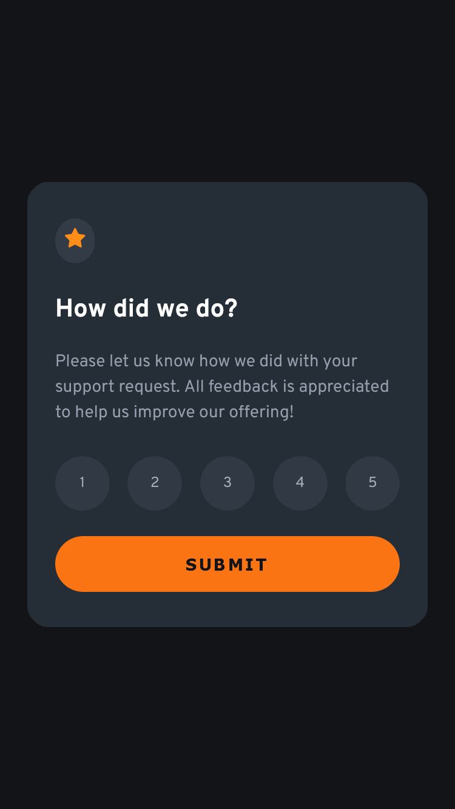
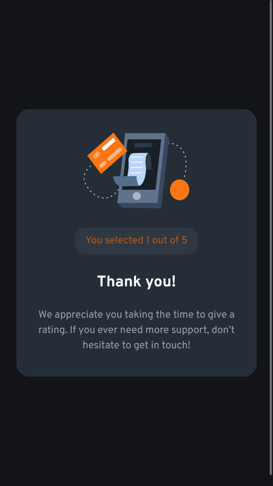
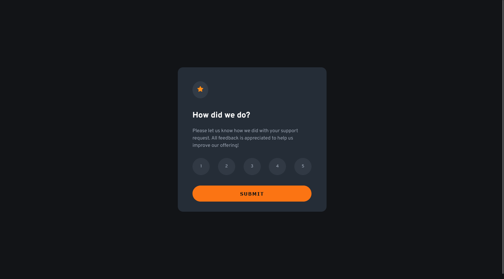
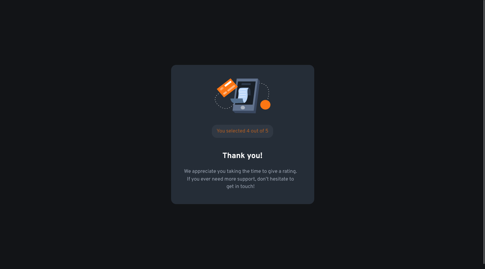

# Frontend Mentor - Interactive rating component

## Deploying your project

As mentioned above, there are many ways to host your project for free. Our recommended hosts are:

- [GitHub Pages](https://pages.github.com/)
- [Vercel](https://vercel.com/)
- [Netlify](https://www.netlify.com/)

## Got feedback for us?

We love receiving feedback! We're always looking to improve our challenges and our platform. So if you have anything you'd like to mention, please email hi[at]frontendmentor[dot]io.

# Frontend Mentor - Interactive rating component solution

This is a solution to the [Interactive rating component challenge on Frontend Mentor](https://www.frontendmentor.io/challenges/interactive-rating-component-koxpeBUmI). Frontend Mentor challenges help you improve your coding skills by building realistic projects. 

## Table of contents

- [Overview](#overview)
  - [The challenge](#the-challenge)
  - [Screenshot](#screenshot)
  - [Links](#links)
- [My process](#my-process)
  - [Built with](#built-with)
  - [What I learned](#what-i-learned)
  - [Continued development](#continued-development)
- [Author](#author)

## Overview
- Se trata de un desafío en el que el usuario pone una nota del 1 al 5 para saber como de satisfecho está.

- Se compone de 2 partes, una es la tarjeta donde se califica y envía la calificación y la otra en la que se muestra la calificación enviada y nos da las gracias.

### The challenge

- En este reto, hay de todo. Elementos interactivos tipo hover o focus, manipulación del DOM. Con extracción de datos de forma dinámica, eventos (al pulsar un elemento HTML).

- En este caso no he enviado los datos, pués necesitaría de una etiqueta form y un evento submit. Enviarlo a una base de datos y hacer una validación desde el backend.

### Screenshot

### Links

- Solution URL: [solución frontend mentor](https://github.com/juan-mentor/interactive-rating-component-main.git)
- Live Site URL: [lugar en vivo](https://juan-mentor.github.io/interactive-rating-component-main/)

## My process
- Es el primer desafío en el que necesito de un lenguaje de programación (en este caso javascript).

- La forma de estructurar mi código ha sido algo diferente, pués necesito tener en cuenta multiples factores.

- Lo primero que me he tenido que plantear es si hago 2 HTML en 2 archivos distintos (uno para la tarjeta de puntuación y el otro para la tarjeta de gracias.), o como en este caso, hago un HTML con las dos tarjetas y oculto una de ellas (con position y z-index).

- Después me he centrado en los estilos de móvil, para las dos tarjetas.

- Seguidamente he empezado con javascript, he creado una carpeta llamada js y dentro de ella he creado un archivo (main.js).

- Por último me he dedicado con una consulta de medios a escribir los estilos de escritorio.

### Built with

- Semantic HTML5 markup
- CSS custom properties
- Mobile-first workflow

### What I learned

He aprendido que no existe la solución única y que puedes hacer las cosas de manera muy distinta. Lo que me pregunto es ¿ como sé que mi solución es la más idónea o eficiente?.

### Continued development

- Me gustaría seguir ampliando conocimientos en la lógica de programación y en javascript (fundamentos básicos).

## Author

- Frontend Mentor - [@juan-mentor](https://www.frontendmentor.io/profile/juan-mentor)

## Acknowledgments

- Quisiera agradecer las sugerencias que me hizo
**@tomwinskell**, que me ayudaron a que se entienda mejor mi código. 

- Incorporo comentarios dentro del código para separar estilos generales de los particulares.